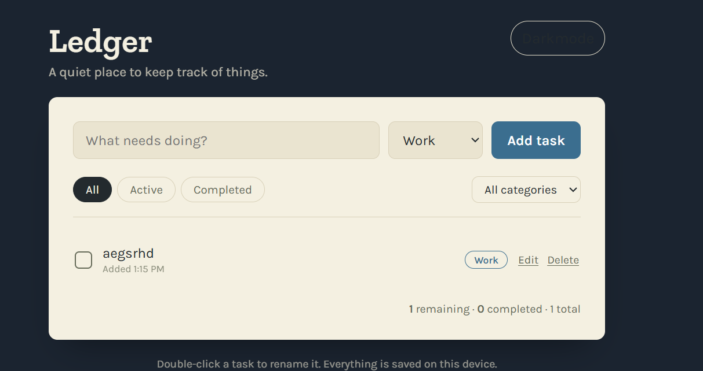
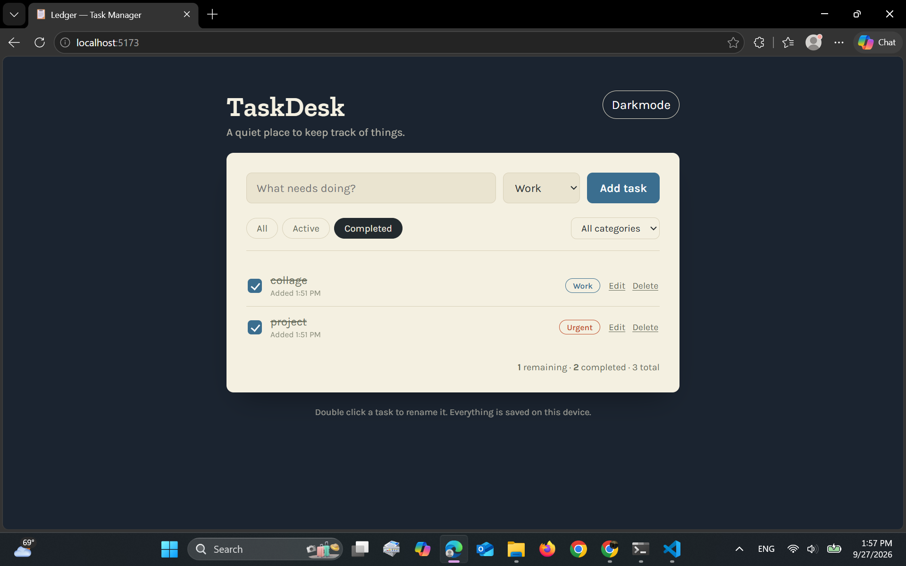
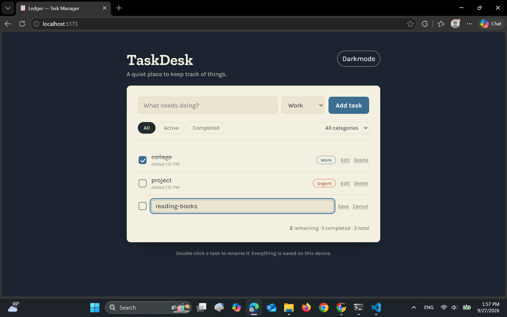

# TaskDesk — Personal Task Manager

TaskDesk is a single-page task manager built with React. You can add tasks under a
category, filter them by status or category, and everything is saved to your
browser automatically so your list is still there when you come back.

## Features

- Add, edit (double-click a task or use the **Edit** link), and delete tasks
- Mark tasks complete/active with a checkbox
- Organize tasks into three categories: **Work**, **Personal**, **Urgent**
- Filter by status (All / Active / Completed) and by category
- Live count of remaining, completed, and total tasks
- Data persists in `localStorage`, so a page refresh doesn't lose anything
- Dark / light theme toggle (also persisted)
- Responsive layout — works down to small mobile widths
- Dark and light theme

## Technologies used

- [React 19](https://react.dev/) — functional components + hooks only (`useState`, `useEffect`, `useMemo`)
- [Vite](https://vitejs.dev/) — dev server and build tool
- Plain CSS (custom properties for theming, no UI framework)
- Browser `localStorage` API for persistence
- Google Fonts: Zilla Slab (headings) + Karla (body/UI)
- JavaScript
- Html

## Project structure

## Project Structure

```text
src/
├── components/
│   ├── TaskForm.jsx        # Controlled form for adding and editing tasks
│   ├── TaskList.jsx        # Maps tasks to TaskItem and handles empty state
│   ├── TaskItem.jsx        # Individual task row with toggle, edit, and delete
│   ├── FilterBar.jsx       # Status and category filter controls
│   ├── TaskStats.jsx       # Displays remaining, completed, and total counts
│   └── ThemeToggle.jsx     # Light/dark theme switch
├── hooks/
│   └── useLocalStorage.js  # Custom hook for localStorage persistence
├── categories.js           # Shared task categories and colors
├── App.jsx                 # Main component that manages application state
├── App.css                 # Main application and component styles
├── index.css               # Global styles and theme styles
└── main.jsx                # React application entry point

## Setup instructions

You'll need [Node.js](https://nodejs.org/) (v18 or later) installed.

```bash
# 1. Install dependencies
npm install

# 2. Run the dev server
npm run dev
```

Then open the URL Vite prints (usually `http://localhost:5173`) in your browser.

To build a production version:

```bash
npm run build
npm run preview   # serve the production build locally to check it
```

## Screenshots

## Screenshots

### Main Task View



### Task Filtering



### Task Editing



## Known limitations

- No drag-and-drop reordering (listed as a stretch goal, not implemented)
- No due dates / overdue indicators
- Categories are a fixed set (Work / Personal / Urgent) rather than user-defined
